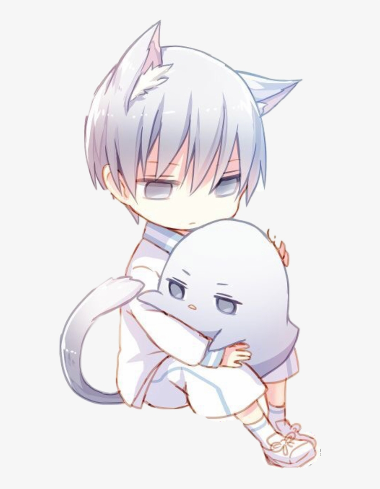

# Anime Central 
## Catboy anime images using the Catboys.com API

### What Is It
This app fetches random images from the Catboys.com API. When you select 'Click Me', it either populates a new image or, if it has a valid source url, it takes you to the website it was posted on. The app shows the image, the artist's name, and the 'Click Me' link.

### Why I Made It
For this MITxPro challenge, we were tasked with utilizing useEffect to make a request to an outside source. I used axios to make the fetch. I also utilized the Bootstrap Carousel component to house the images.

### What I Found Challenging
The carousel was difficult to work with. I installed bootsrap and it didn't show the `next` and `previous` buttons in my code so I wasn't able to add links to them like I wanted. It also took me a while to figure out how to use an API key since this was my first time trying to fetch data on my own. Next time, I wouldn't use a carousel or I would try to make it more manageable.

